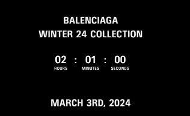

# React Countdown Timer Application for Boutique Design Platform

Welcome to Digitec Innovation. In our pursuit of continuous improvement, we're searching for talented individuals like yourself to become part of our team. This phase of the interview evaluates your coding efficiency and expertise.

## Task Overview

Your assignment is to create a React application that features a countdown timer for the upcoming launch of new merchandise on a Boutique Design Platform. This application should replicate the design illustrated in the "countdown-balenciaga.jpg" image provided below.

The React application must include two pages: a Home page, and a Countdown page. The Home page will include a date & time picker for choosing a future point in time, followed by a button to proceed to the Countdown page. There, users will view the remaining time in hours, minutes, and seconds. The countdown timer must update every second to accurately simulate a countdown clock.

### Requirements

1. Create a new branch; then proceed to debug and install the necessary packages:

    `npm install`

3. Set a Target Date: Within App.js, establish a target date for the merchandise launch. (You might set the target date to 25th March 2024, 11:59 PM, for example.)

4. Pass Target Date to Component: Relay this target date as props to the Countdown.js component.

5. Countdown Calculation: Employ a suitable library to calculate and display the time left until the target date.

6. Loading Delay: Implement a 5-second loading delay before displaying the countdown page, marked by a loading spinner. (The spinner can be of any design, but it should be visible to the user for 5 seconds, typically encompassing the whole page with a central loading animation.)

7. Design Implementation: Replicate the design as closely as possible from the "countdown-balenciaga.jpg", including the countdown timer and any additional elements presented in the image.

### Deliverables

Upon completion, your project should encompass the following:

* A functional React application that aligns with the design and functional criteria.

* A Countdown.js component that receives the target date through props and shows the time remaining.

* An initial loading state with a spinner, transitioning to the countdown timer following a 5-second spinner animation.

* A user interface that replicates the "countdown-balenciaga.jpg" design.

* Responsive web design accommodating both web and mobile dimensions.

We will evaluate your submission by running `npm i && npm start`. Your deliverable will be judged based on the quality of your code and the time taken to complete the task.

#### Best of luck with your task!.
